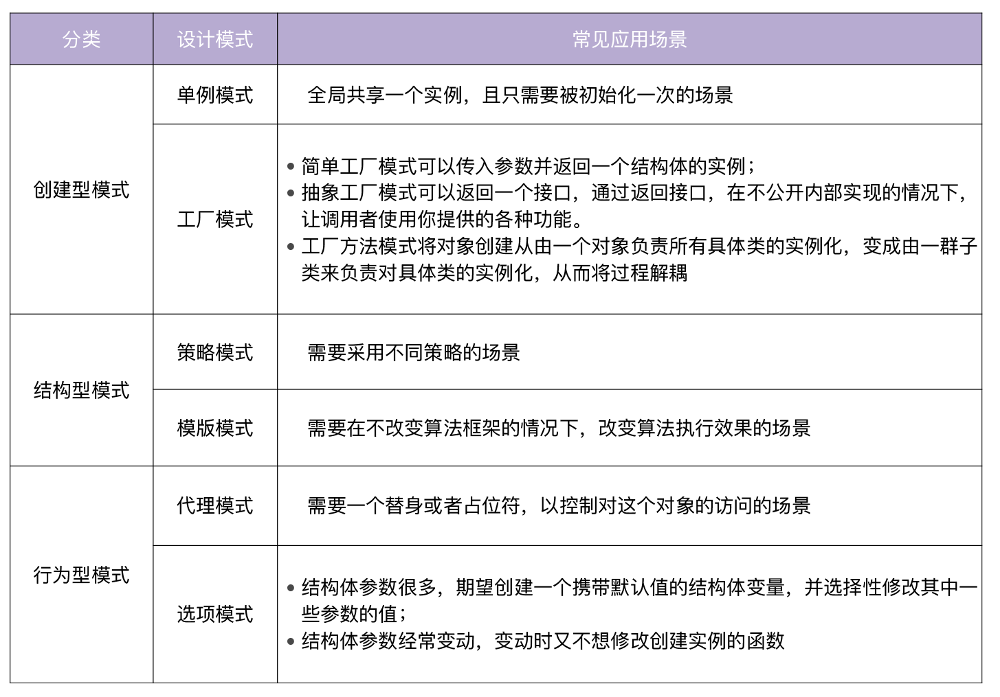

## [工厂模式](./design/factory.go)
工厂模式（Factory Pattern）是面向对象编程中的常用模式。在 Go 项目开发中，你可以通过使用多种不同的工厂模式，来使代码更简洁明了。Go 中的结构体，可以理解为面向对象编程中的类，例如 Person 结构体（类）实现了 Greet 方法。
```
type Person struct {
  Name string
  Age int
}

func (p Person) Greet() {
  fmt.Printf("Hi! My name is %s", p.Name)
}
```

有了 Person“类”，就可以创建 Person 实例。我们可以通过简单工厂模式、抽象工厂模式、工厂方法模式这三种方式，来创建一个 Person 实例。这三种工厂模式中，简单工厂模式是最常用、最简单的。它就是一个接受一些参数，然后返回 Person 实例的函数：
```
type Person struct {
  Name string
  Age int
}

func (p Person) Greet() {
  fmt.Printf("Hi! My name is %s", p.Name)
}

func NewPerson(name string, age int) *Person {
  return &Person{
    Name: name,
    Age: age,
  }
}
```


## [单例模式](./design/singleton.go)
单例模式（Singleton Pattern），是最简单的一个模式。在 Go 中，单例模式指的是全局只有一个实例，并且它负责创建自己的对象。单例模式不仅有利于减少内存开支，还有减少系统性能开销、防止多个实例产生冲突等优点。


## [策略模式](./design/strategy.go)
策略模式（Strategy Pattern）定义一组算法，将每个算法都封装起来，并且使它们之间可以互换。在什么时候，我们需要用到策略模式呢？在项目开发中，我们经常要根据不同的场景，采取不同的措施，也就是不同的策略。比如，假设我们需要对 a、b 这两个整数进行计算，根据条件的不同，需要执行不同的计算方式。我们可以把所有的操作都封装在同一个函数中，然后通过 if ... else ... 的形式来调用不同的计算方式，这种方式称之为硬编码。在实际应用中，随着功能和体验的不断增长，我们需要经常添加 / 修改策略，这样就需要不断修改已有代码，不仅会让这个函数越来越难维护，还可能因为修改带来一些 bug。所以为了解耦，需要使用策略模式，定义一些独立的类来封装不同的算法，每一个类封装一个具体的算法（即策略）。

## [模板模式](./design/template.go.go)
模板模式 (Template Pattern) 定义一个操作中算法的骨架，而将一些步骤延迟到子类中。这种方法让子类在不改变一个算法结构的情况下，就能重新定义该算法的某些特定步骤。简单来说，模板模式就是将一个类中能够公共使用的方法放置在抽象类中实现，将不能公共使用的方法作为抽象方法，强制子类去实现，这样就做到了将一个类作为一个模板，让开发者去填充需要填充的地方。


## [代理模式](./design/proxy-pattern.go.go)
代理模式 (Proxy Pattern)，可以为另一个对象提供一个替身或者占位符，以控制对这个对象的访问。


## [选项模式](./design/option-pattern.go.go)
选项模式（Options Pattern）也是 Go 项目开发中经常使用到的模式，例如，grpc/grpc-go 的NewServer函数，uber-go/zap 包的New函数都用到了选项模式。使用选项模式，我们可以创建一个带有默认值的 struct 变量，并选择性地修改其中一些参数的值。在 Python 语言中，创建一个对象时，可以给参数设置默认值，这样在不传入任何参数时，可以返回携带默认值的对象，并在需要时修改对象的属性。这种特性可以大大简化开发者创建一个对象的成本，尤其是在对象拥有众多属性时。



